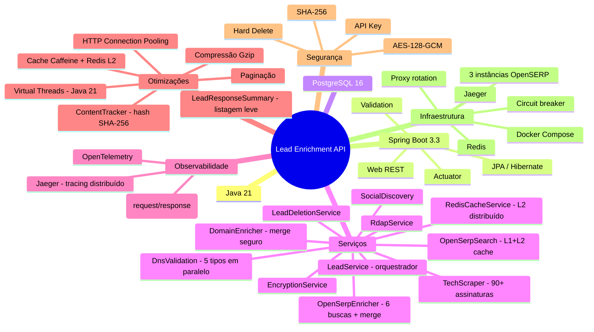

[](https://sonarcloud.io/summary/new_code?id=pdrodavi_lead-enrichment-api) [](https://sonarcloud.io/summary/new_code?id=pdrodavi_lead-enrichment-api) [](https://sonarcloud.io/summary/new_code?id=pdrodavi_lead-enrichment-api) [](https://sonarcloud.io/summary/new_code?id=pdrodavi_lead-enrichment-api) [](https://sonarcloud.io/summary/new_code?id=pdrodavi_lead-enrichment-api) [](https://sonarcloud.io/summary/new_code?id=pdrodavi_lead-enrichment-api) [](https://sonarcloud.io/summary/new_code?id=pdrodavi_lead-enrichment-api) [](https://sonarcloud.io/summary/new_code?id=pdrodavi_lead-enrichment-api)

# Lead Enrichment API — Documentação Técnica

## Visão Geral

API corporativa para enriquecimento de leads a partir de dados públicos da internet. A partir de um nome e e-mail, o sistema orquestra múltiplos serviços especializados para descobrir informações sobre domínio, stack tecnológica, presença em redes sociais e dados de registro de domínio — operando em conformidade com os requisitos da LGPD.

**Público-alvo:** Arquitetos de software, tech leads e engenheiros responsáveis pela evolução, integração e governança do sistema.

---

## Navegação da Documentação

| Documento | Conteúdo |
|---|---|
| [📐 Arquitetura do Sistema](./docs/architecture.md) | Diagramas estruturais, fluxos de dados, stack tecnológica e organização do projeto |
| [📡 Guia da API](./docs/api-guide.md) | Contratos dos endpoints, parâmetros, exemplos de requisição/resposta e código de erros |
| [🚀 Guia de Implantação](./docs/deployment.md) | Docker Compose, variáveis de ambiente, estratégia de produção e troubleshooting |
| [🔒 Segurança e LGPD](./docs/security-lgpd.md) | Criptografia AES-128-GCM, mascaramento de PII, autenticação por API Key e compliance |
| [📜 Contrato OpenAPI (YAML)](./docs/openapi.yaml) | Especificação OpenAPI 3.0 completa para geração automatizada de clientes |
| [🔧 Referência Técnica](./docs/TECHNICAL_REFERENCE.md) | Arquitetura em camadas, pipeline de enriquecimento, performance e dependências |
| [👋 Guia de Onboarding](./docs/ONBOARDING.md) | Configuração do ambiente local, fluxo de desenvolvimento e troubleshooting |

---

## Architecture Decision Records (ADRs)

Registro formal de decisões arquiteturais com contexto, alternativas consideradas e justificativas.

| ID | Decisão | Escopo |
|---|---|---|
| [ADR-001](./docs/adr/ADR-001-stack-tecnologica.md) | **Java 21** + Spring Boot 3.3 + Maven + Lombok | Stack tecnológica |
| [ADR-002](./docs/adr/ADR-002-postgresql-jpa.md) | PostgreSQL 16 com `ddl-auto=update` e `@ElementCollection` | Persistência |
| [ADR-003](./docs/adr/ADR-003-criptografia-pii-aes-gcm.md) | AES-128-GCM via `AttributeConverter` + SHA-256 hash para consulta | Proteção de PII |
| [ADR-004](./docs/adr/ADR-004-soft-delete-lgpd.md) | **Hard delete** via `LeadDeletionService` (única consulta) | Exclusão LGPD |
| [ADR-005](./docs/adr/ADR-005-api-key-autenticacao.md) | Servlet Filter com validação do header `X-API-KEY` | Autenticação |
| [ADR-006](./docs/adr/ADR-006-arquitetura-enriquecimento.md) | Orquestração centralizada — 12 serviços especializados com isolamento de falhas | Pipeline de enriquecimento |
| [ADR-007](./docs/adr/ADR-007-springdoc-openapi.md) | Swagger UI auto-gerado via SpringDoc com schema de segurança documentado | Documentação da API |
| [ADR-008](./docs/adr/ADR-008-mascaramento-dados-lgpd.md) | `EmailUtils` com mascaramento centralizado em logs e respostas | Privacidade de dados |
| [ADR-009](./docs/adr/ADR-009-tratamento-global-erros.md) | `@RestControllerAdvice` com resposta JSON padronizada | Tratamento de erros |
| [ADR-010](./docs/adr/ADR-010-configuracao-externalizada.md) | `@ConfigurationProperties` para módulos TechScraper, SocialDiscovery e OpenSerpProxy | Configuração externalizada |

> Para arquitetos, recomenda-se iniciar pelos **ADRs 001, 003, 006 e 008**, que definem as decisões estruturais mais relevantes.

---

## Diagramas da Arquitetura

Diagramas em Mermaid com renderização nativa no GitHub e no VS Code.

| Diagrama | Arquivo | Abrangência |
|---|---|---|
| [🟦 Componentes e Sequência](./docs/diagrams/mermaid-componentes-sequencia.md) | `docs/diagrams/mermaid-componentes-sequencia.md` | Diagrama de componentes (4 camadas), modelo de domínio e sequência completa de enriquecimento |
| [🔀 Fluxo de Enriquecimento](./docs/diagrams/mermaid-fluxo-enriquecimento.md) | `docs/diagrams/mermaid-fluxo-enriquecimento.md` | Máquina de estados do Lead (PENDING → ENRICHED → DELETED) e fluxograma reduzido vs. completo |
| [⚙️ Fluxo de Processamento](./docs/diagrams/mermaid-fluxo-processamento-api.md) | `docs/diagrams/mermaid-fluxo-processamento-api.md` | Fluxo requisição/resposta para todos os 6 endpoints e mapa de contexto |

---

## Evolução Arquitetural

Aprimoramentos implementados ao longo de ciclos de revisão, organizados por domínio arquitetural:

### Segurança
- Credenciais externalizadas para `.env` (remoção de valores hard-coded)
- Criptografia AES-128-GCM sem fallback e com log + throw em falha de descriptografia
- Autenticação por API Key via Servlet Filter com validação de header

### Plataforma e Runtime
- Migração JDK 17 → 21 com Virtual Threads (`Executors.newVirtualThreadPerTaskExecutor()`)
- Observabilidade com OpenTelemetry + Jaeger (`management.otlp.tracing.endpoint`)
- Captura de corpo de requisição e resposta para tracing distribuído

### Performance e Concorrência
- Cache em dois níveis: Caffeine (L1, 7 caches) + Redis (L2)
- ContentTracker com hash SHA-256 para detecção de conteúdo duplicado
- HTTP Connection Pooling com HttpClient 5
- Compressão Gzip e paginação em endpoints de listagem
- Consultas DNS paralelas (5 tipos) e 6 buscas OpenSERP simultâneas
- Merge seguro contra race condition com cópia defensiva em todos os métodos de cache

### Refatoração da Arquitetura
- Extração de responsabilidades: `LeadService` decomposto em `OpenSerpEnricher`, `DomainEnricher`, `LeadDeletionService`, `RedisCacheService` e `DataParser`
- Eliminação de N+1 com `@Fetch(FetchMode.SUBSELECT)`, lock otimista com `@Version` e `@BatchSize`

### Manutenibilidade
- Adoção de `@Getter`/`@Setter` no modelo `Lead`, `@ConfigurationPropertiesScan`, `@EnableCaching`, `@EnableSpringDataWebSupport(VIA_DTO)`
- Cache declarativo com `@Cacheable("enrich-result")` e `@CacheEvict` manual em atualizações e exclusões
- 10 ADRs documentando decisões arquiteturais

### Enriquecimento de Dados
- Campo `exposedPhones` adicionado ao modelo `Lead` e DTO `DiscoveryData` (telefones expostos)
- Deduplicação de `nameMentions` por URL, `foundDocuments`/`discoveredUrls` e itens OpenSERP
- Filtragem de `socialLinks` por nome/e-mail da pessoa (`filterSocialLinksByPerson`)
- Snapshot/Restore automático via `EnrichmentSnapshotManager`: se o reenriquecimento falhar (ex: CAPTCHA), dados anteriores são preservados
- Busca em sites `.com`/`.com.br` via `DotComScrapingService` quando nenhum domínio é informado

---

## Início Rápido

```bash
# 1. Configurar variáveis de ambiente
cp .env.example .env
# Editar .env com os valores reais

# 2. Executar com Docker Compose
docker compose up --build

# 3. Executar localmente com JDK 21
build-jdk21.bat spring-boot:run -Dmaven.test.skip=true

# 4. Testar o endpoint de enriquecimento
curl -H "X-API-KEY: $(grep API_KEY .env | cut -d= -f2)" \
  -H "Content-Type: application/json" \
  -X POST http://localhost:${PORT:-8081}/api/v1/leads/enrich \
  -d '{"email":"contato@exemplo.com","name":"João Silva"}'

# 5. Swagger UI: http://localhost:${PORT:-8081}/swagger-ui.html
# 6. Jaeger UI:  http://localhost:16686
```

## Stack Tecnológica



## Licença

Copyright © 2026 — pdroti.solutions