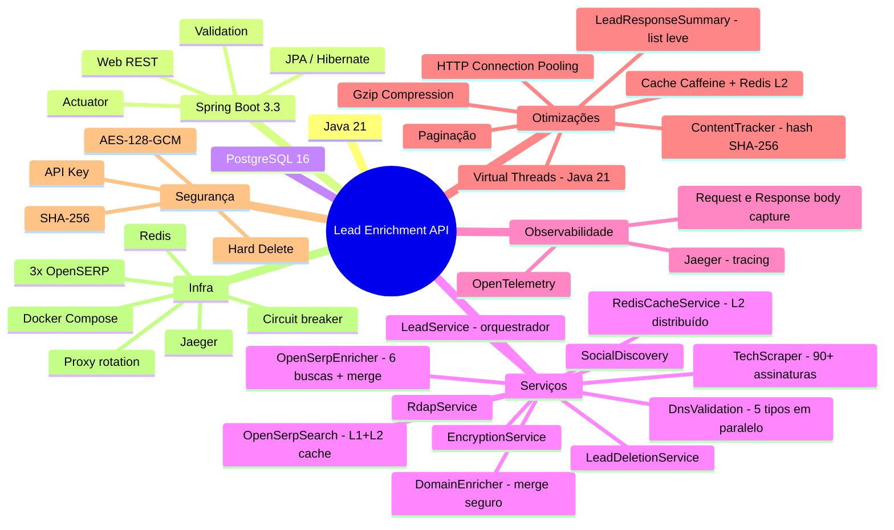

# Documentação da Lead Enrichment API

## Sobre

API para enriquecimento de leads com dados públicos da internet. A partir de um nome e e-mail, descobre informações sobre o domínio, tecnologias utilizadas, presença em redes sociais e dados de registro de domínio — tudo em conformidade com a LGPD.

## Índice da Documentação

| Documento | Descrição |
|---|---|
| [📐 Arquitetura](./docs/architecture.md) | Diagramas, fluxos, stack tecnológica e estrutura do projeto |
| [📡 Guia da API](./docs/api-guide.md) | Endpoints, parâmetros, exemplos de requisição/resposta e erros |
| [🚀 Guia de Deploy](./docs/deployment.md) | Docker, variáveis de ambiente, produção e troubleshooting |
| [🔒 Segurança e LGPD](./docs/security-lgpd.md) | Criptografia, mascaramento, autenticação, exclusão permanente e compliance |
| [📜 OpenAPI Spec (YAML)](./docs/openapi.yaml) | Documentação OpenAPI 3.0 completa para geração de clientes |
| [🔧 Referência Técnica](./docs/TECHNICAL_REFERENCE.md) | Arquitetura detalhada, camadas, pipeline, performance, dependências |
| [👋 Guia de Onboarding](./docs/ONBOARDING.md) | Configuração do ambiente, fluxo de desenvolvimento, troubleshooting |
## Architecture Decision Records (ADRs)

| ID | Título | Decisão Principal |
|---|---|---|
| [ADR-001](./docs/adr/ADR-001-stack-tecnologica.md) | Stack Tecnológica | **Java 21** + Spring Boot 3.3 + Maven + Lombok |
| [ADR-002](./docs/adr/ADR-002-postgresql-jpa.md) | PostgreSQL + Spring Data JPA | PostgreSQL 16 com ddl-auto=update e @ElementCollection |
| [ADR-003](./docs/adr/ADR-003-criptografia-pii-aes-gcm.md) | Criptografia de PII (LGPD) | AES-128-GCM via AttributeConverter + SHA-256 hash para consulta |
| [ADR-004](./docs/adr/ADR-004-soft-delete-lgpd.md) | Exclusão para LGPD | **Hard delete** via LeadDeletionService (1 query) |
| [ADR-005](./docs/adr/ADR-005-api-key-autenticacao.md) | Autenticação via API Key | Servlet Filter com validação de header X-API-KEY |
| [ADR-006](./docs/adr/ADR-006-arquitetura-enriquecimento.md) | Arquitetura de Enriquecimento | Orquestração centralizada com 12 serviços especializados e isolamento de falhas |
| [ADR-007](./docs/adr/ADR-007-springdoc-openapi.md) | Documentação com SpringDoc/OpenAPI | Swagger UI auto-gerado com schema de segurança documentado |
| [ADR-008](./docs/adr/ADR-008-mascaramento-dados-lgpd.md) | Mascaramento de Dados (LGPD) | EmailUtils com mascaramento centralizado em logs e respostas |
| [ADR-009](./docs/adr/ADR-009-tratamento-global-erros.md) | Tratamento Global de Erros | @RestControllerAdvice com JSON padronizado |
| [ADR-010](./docs/adr/ADR-010-configuracao-externalizada.md) | Configuração Externalizada | @ConfigurationProperties para TechScraper, SocialDiscovery e OpenSerpProxy |

## Diagramas

### Mermaid (renderização nativa no GitHub/VS Code)

| Diagrama | Arquivo | Conteúdo |
|---|---|---|
| [🟦 Componentes + Sequência](./docs/diagrams/mermaid-componentes-sequencia.md) | `docs/diagrams/mermaid-componentes-sequencia.md` | Diagrama de componentes (4 camadas), diagrama de classes (modelo de domínio) e diagrama de sequência (enriquecimento completo) |
| [🔀 Fluxo de Enriquecimento](./docs/diagrams/mermaid-fluxo-enriquecimento.md) | `docs/diagrams/mermaid-fluxo-enriquecimento.md` | Diagrama de estados do Lead (PENDING → ENRICHED → DELETED), fluxograma completo vs. reduzido e diagrama de pacotes |
| [⚙️ Fluxo de Processamento](./docs/diagrams/mermaid-fluxo-processamento-api.md) | `docs/diagrams/mermaid-fluxo-processamento-api.md` | Fluxograma detalhado de requisição/resposta para todos os 6 endpoints, diagrama de contexto, estados do hard delete e mapa de endpoints |

> 💡 **Dica:** Os diagramas Mermaid renderizam automaticamente no GitHub e no VS Code (com extensão Mermaid).

---

## Refatorações Realizadas

Após ciclos de revisão de código, dezenas de melhorias foram implementadas:

| Categoria | Principais correções |
|---|---|
| 🔴 Segurança | Credenciais removidas para `.env`, criptografia sem fallback, log + throw na descriptografia, API Key via filter |
| 🟢 Java 21 | Migração JDK 17 → 21 com Virtual Threads (`Executors.newVirtualThreadPerTaskExecutor()`) |
| 🟢 Observabilidade | OpenTelemetry + Jaeger (`management.otlp.tracing.endpoint`) com captura de request/response body |
| 🟢 Performance | Cache Caffeine (7 caches) + Redis L2, ContentTracker (hash SHA-256), HTTP Connection Pooling (HttpClient 5), compressão Gzip, paginação |
| 🔴 Performance | Consultas DNS paralelas (5 tipos), 6 buscas OpenSERP em paralelo, merge seguro contra race condition, cópia defensiva em todos os 7 métodos de cache |
| 🟡 Infra | Docker Compose com Jaeger, Redis, 3 OpenSERP, rede npm, proxy rotation + circuit breaker |
| 🟡 Arquitetura | `LeadService` extraído em `OpenSerpEnricher`, `DomainEnricher`, `LeadDeletionService`, `RedisCacheService`, `DataParser` |
| 🟡 JPA | `@Fetch(FetchMode.SUBSELECT)` para eliminar N+1, `@Version` para lock otimista, `@BatchSize` |
| 🔵 Manutenibilidade | `@Getter @Setter` no `Lead`, `@ConfigurationPropertiesScan`, `@EnableCaching`, `@EnableSpringDataWebSupport(VIA_DTO)` |
| 🔵 Cache | `@Cacheable("enrich-result")` no endpoint, `@CacheEvict` manual no update (old + new email) |
| 📚 Documentação | 10 ADRs, diagramas Mermaid atualizados com cache L1+L2 e merge seguro, guias revisados |

---

## Quick Start

```bash
# 1. Configure as variáveis de ambiente
cp .env.example .env
# Edite .env com seus valores reais

# 2. Execute com Docker Compose
docker compose up --build

# 3. Ou execute localmente com JDK 21
build-jdk21.bat spring-boot:run -Dmaven.test.skip=true
# Ou: Ctrl+Shift+B no VS Code (task configurada)

# 4. Acesse a API
curl -H "X-API-KEY: $(grep API_KEY .env | cut -d= -f2)" \
  -H "Content-Type: application/json" \
  -X POST http://localhost:${PORT:-8081}/api/v1/leads/enrich \
  -d '{"email":"contato@exemplo.com","name":"João Silva"}'

# 5. Swagger UI
# Abra http://localhost:${PORT:-8081}/swagger-ui.html

# 6. Jaeger UI
# Abra http://localhost:16686
```

## Stack Principal



## Licença

Copyright © 2026 pdroti.solutions