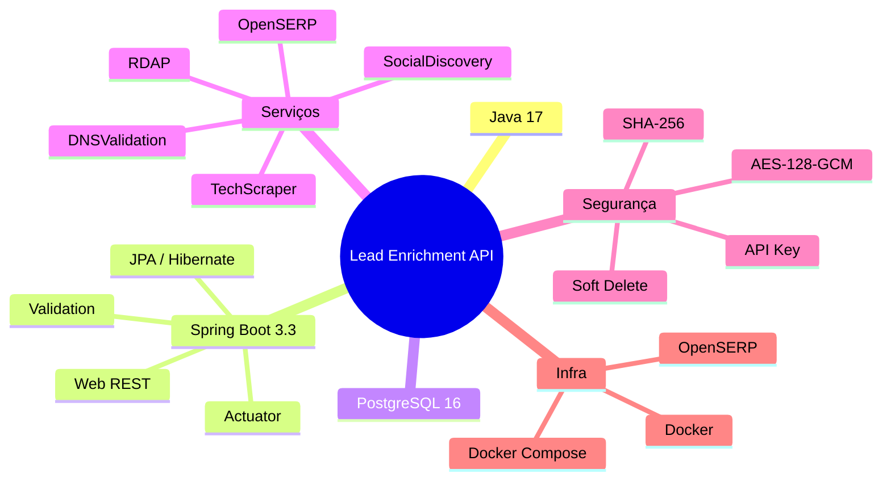

# Documentação da Lead Enrichment API

## Sobre

API para enriquecimento de leads com dados públicos da internet. A partir de um nome e e-mail, descobre informações sobre o domínio, tecnologias utilizadas, presença em redes sociais e dados de registro de domínio — tudo em conformidade com a LGPD.

## Índice da Documentação

| Documento | Descrição |
|---|---|
| [📐 Arquitetura](./docs/architecture.md) | Diagramas, fluxos, stack tecnológica e estrutura do projeto |
| [📡 Guia da API](./docs/api-guide.md) | Endpoints, parâmetros, exemplos de requisição/resposta e erros |
| [🚀 Guia de Deploy](./docs/deployment.md) | Docker, variáveis de ambiente, produção e troubleshooting |
| [🔒 Segurança e LGPD](./docs/security-lgpd.md) | Criptografia, mascaramento, autenticação, soft delete e compliance |
## Architecture Decision Records (ADRs)

| ID | Título | Decisão Principal |
|---|---|---|
| [ADR-001](./docs/adr/ADR-001-stack-tecnologica.md) | Stack Tecnológica | Java 17 + Spring Boot 3.3 + Maven + Lombok |
| [ADR-002](./docs/adr/ADR-002-postgresql-jpa.md) | PostgreSQL + Spring Data JPA | PostgreSQL 16 com ddl-auto=update e @ElementCollection |
| [ADR-003](./docs/adr/ADR-003-criptografia-pii-aes-gcm.md) | Criptografia de PII (LGPD) | AES-128-GCM via AttributeConverter + SHA-256 hash para consulta |
| [ADR-004](./docs/adr/ADR-004-soft-delete-lgpd.md) | Soft Delete para LGPD | Exclusão lógica com retenção de 365 dias |
| [ADR-005](./docs/adr/ADR-005-api-key-autenticacao.md) | Autenticação via API Key | Servlet Filter com validação de header X-API-KEY |
| [ADR-006](./docs/adr/ADR-006-arquitetura-enriquecimento.md) | Arquitetura de Enriquecimento | Orquestração centralizada com 5 serviços especializados e isolamento de falhas |
| [ADR-007](./docs/adr/ADR-007-springdoc-openapi.md) | Documentação com SpringDoc/OpenAPI | Swagger UI auto-gerado com schema de segurança documentado |
| [ADR-008](./docs/adr/ADR-008-mascaramento-dados-lgpd.md) | Mascaramento de Dados (LGPD) | EmailUtils com mascaramento centralizado em logs e respostas |
| [ADR-009](./docs/adr/ADR-009-tratamento-global-erros.md) | Tratamento Global de Erros | @RestControllerAdvice com JSON padronizado |

## Diagramas

### Mermaid (renderização nativa no GitHub/VS Code)

| Diagrama | Arquivo | Conteúdo |
|---|---|---|
| [🟦 Componentes + Sequência](./docs/diagrams/mermaid-componentes-sequencia.md) | `docs/diagrams/mermaid-componentes-sequencia.md` | Diagrama de componentes (4 camadas), diagrama de classes (modelo de domínio) e diagrama de sequência (enriquecimento completo) |
| [🔀 Fluxo de Enriquecimento](./docs/diagrams/mermaid-fluxo-enriquecimento.md) | `docs/diagrams/mermaid-fluxo-enriquecimento.md` | Diagrama de estados do Lead (PENDING → ENRICHED → DELETED), fluxograma completo vs. reduzido e diagrama de pacotes |
| [⚙️ Fluxo de Processamento](./docs/diagrams/mermaid-fluxo-processamento-api.md) | `docs/diagrams/mermaid-fluxo-processamento-api.md` | Fluxograma detalhado de requisição/resposta para todos os 6 endpoints, diagrama de contexto, estados do soft delete LGPD e mapa de endpoints |

> 💡 **Dica:** Os diagramas Mermaid renderizam automaticamente no GitHub e no VS Code (com extensão Mermaid).

---

## Melhorias e Refatorações Realizadas

Ao longo de 8 rodadas de revisão de código, **22 issues** foram identificadas e corrigidas:

| Categoria | Qtd | Principais correções |
|---|---|---|
| 🔴 Segurança | 3 | SecureRandom não-bloqueante, criptografia sem fallback, mascaramento LGPD |
| 🔴 Performance | 1 | `@ElementCollection LAZY`, scraping combinado (1 HTTP) |
| 🟡 Arquitetura | 6 | Sub-records, ObjectMapper injetado, OkHttp → RestTemplate |
| 🔵 Manutenibilidade | 11 | Configs externalizadas para YAML, ADRs, diagramas, imports limpos |
| 📚 Documentação | - | 9 ADRs, diagramas Mermaid + Excalidraw, guias completos |

---

## Quick Start

```bash
# 1. Clone o repositório
git clone <url-do-repositorio>
cd lead-enrichment-api

# 2. Execute com Docker Compose
docker compose up --build

# 3. Acesse a API
curl -H "X-API-KEY: b6vxAgj5KG5HPGCKlQQ7" \
  -H "Content-Type: application/json" \
  -X POST http://localhost:8781/api/v1/leads/enrich \
  -d '{"email":"contato@exemplo.com","name":"João Silva"}'

# 4. Swagger UI
# Abra http://localhost:8081/swagger-ui.html
```

## Stack Principal



## Licença

Copyright © 2026 pdroti.solutions