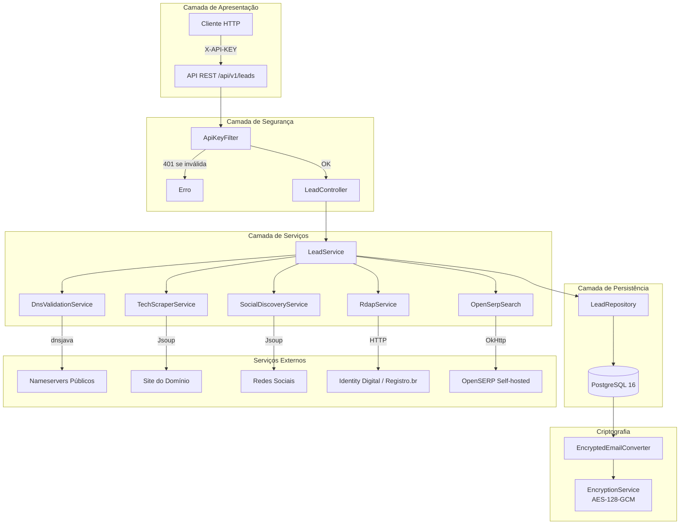
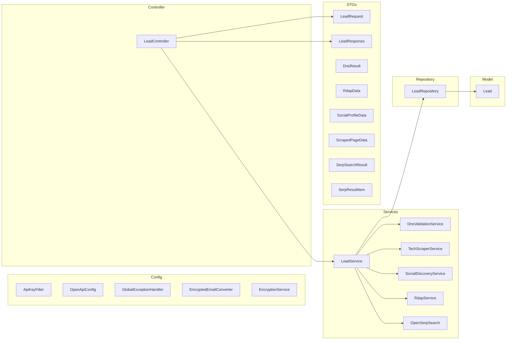
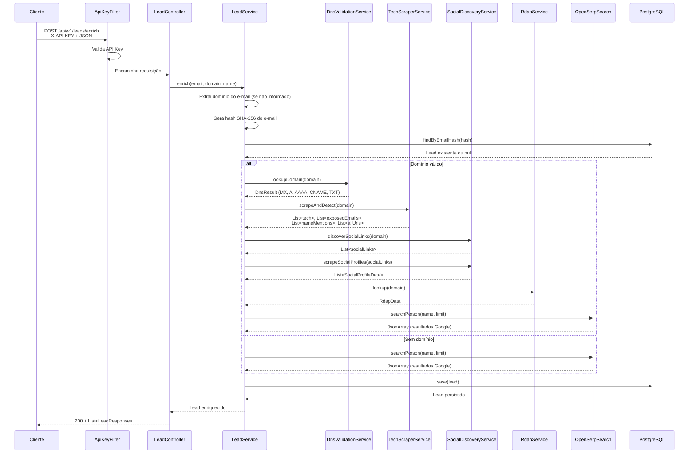

# Arquitetura do Sistema

## Visão Geral

A **Lead Enrichment API** é uma aplicação Spring Boot que enriquece dados de leads a partir de informações públicas disponíveis na internet. Utiliza uma arquitetura de microsserviço monolítico com componentes bem separados por responsabilidade.



## Diagrama de Componentes



## Fluxo de Enriquecimento



## Stack Tecnológica

| Tecnologia | Versão | Função |
|---|---|---|
| **Java** | 17 | Runtime |
| **Spring Boot** | 3.3.13 | Framework web, JPA, Actuator |
| **Spring Data JPA** | 3.3.x | ORM + Hibernate 6.x |
| **PostgreSQL** | 16 | Banco de dados relacional |
| **dnsjava** | 3.6.0 | Consultas DNS (MX, A, AAAA, CNAME, TXT) |
| **Jsoup** | 1.17.2 | Scraping HTML |
| **OkHttp** | 4.12.0 | Cliente HTTP para OpenSERP |
| **Gson** | 2.11.0 | Parse de JSON |
| **SpringDoc OpenAPI** | 2.5.0 | Swagger UI |
| **Lombok** | - | Redução de boilerplate |
| **Docker** | - | Containerização |
| **OpenSERP** | latest | Google Search API self-hosted |

## Estrutura do Projeto

```
lead-enrichment-api/
├── Dockerfile                    # Imagem Docker multi-stage
├── docker-compose.yml            # Orquestração (PostgreSQL + OpenSERP + API)
├── pom.xml                       # Dependências Maven
├── README.md                     # Documentação principal
├── docs/
│   ├── adr/                      # Architecture Decision Records
│   │   ├── ADR-001-cache-com-redis.md
│   │   ├── ADR-002-lgpd-soft-delete.md
│   │   └── ADR-003-criptografia-pii.md
│   ├── architecture.md           # Este documento
│   ├── api-guide.md              # Guia da API
│   ├── deployment.md             # Guia de deploy
│   └── security-lgpd.md          # Segurança e LGPD
└── src/
    └── main/
        ├── java/solutions/pdroti/lead/enrichment/api/
        │   ├── LeadEnrichmentApplication.java
        │   ├── config/
        │   │   ├── ApiKeyFilter.java
        │   │   ├── EncryptedEmailConverter.java
        │   │   ├── EncryptionService.java
        │   │   ├── GlobalExceptionHandler.java
        │   │   └── OpenApiConfig.java
        │   ├── controller/
        │   │   └── LeadController.java
        │   ├── dto/
        │   │   ├── DnsResult.java
        │   │   ├── LeadRequest.java
        │   │   ├── LeadResponse.java
        │   │   ├── RdapData.java
        │   │   ├── ScrapedPageData.java
        │   │   ├── SerpResultItem.java
        │   │   ├── SerpSearchResult.java
        │   │   └── SocialProfileData.java
        │   ├── model/
        │   │   └── Lead.java
        │   ├── repository/
        │   │   └── LeadRepository.java
        │   ├── service/
        │   │   ├── DnsValidationService.java
        │   │   ├── LeadService.java
        │   │   ├── OpenSerpSearch.java
        │   │   ├── RdapService.java
        │   │   ├── SocialDiscoveryService.java
        │   │   └── TechScraperService.java
        │   └── util/
        │       └── EmailUtils.java
        └── resources/
            └── application.yml
```

## Decisões de Arquitetura (ADRs)

| ADR | Título | Decisão |
|---|---|---|
| [ADR-001](./adr/ADR-001-cache-com-redis.md) | Cache-Aside com Redis | Cache distribuído com Redis para reduzir latência |
| [ADR-002](./adr/ADR-002-lgpd-soft-delete.md) | Soft Delete para LGPD | Exclusão lógica com retenção de 365 dias |
| [ADR-003](./adr/ADR-003-criptografia-pii.md) | Criptografia de PII | AES-128-GCM para e-mails em repouso |
