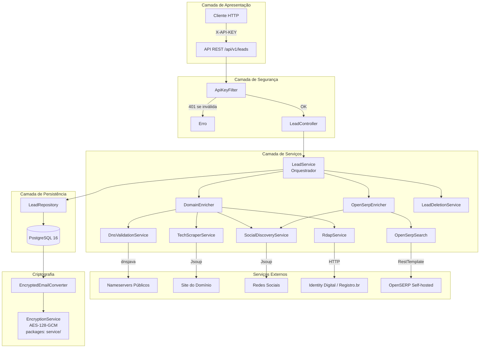
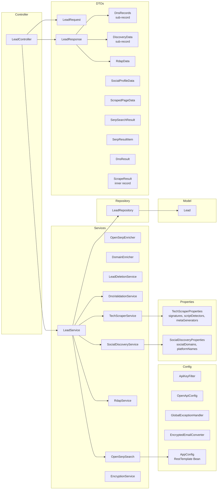
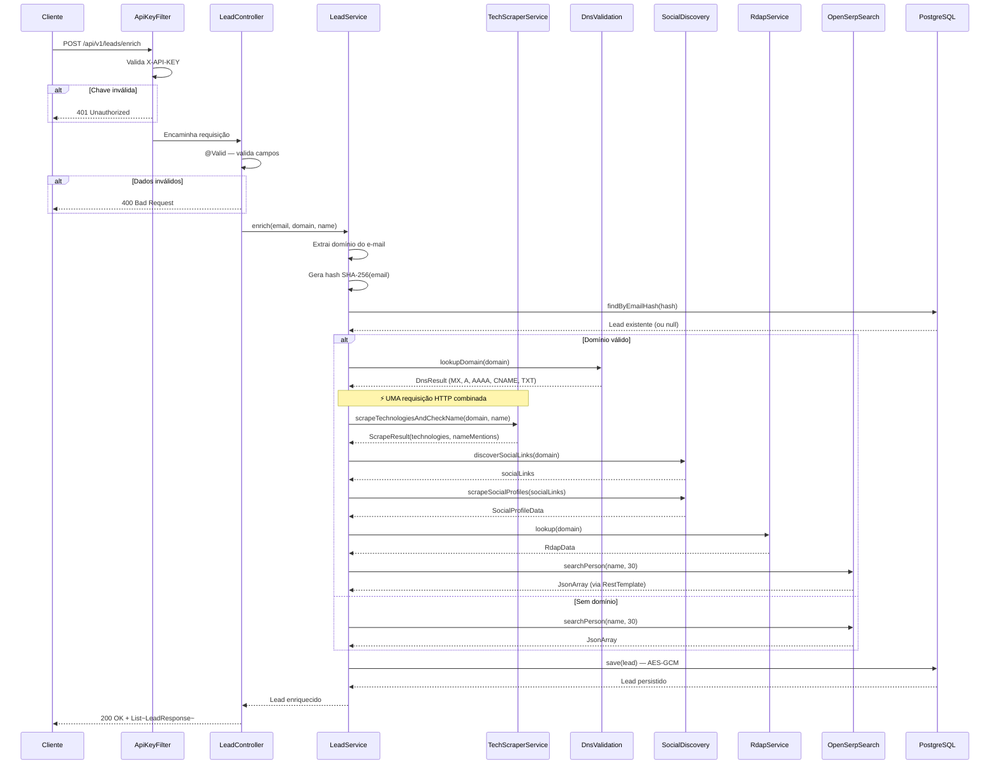

# Arquitetura do Sistema

## Visão Geral

A **Lead Enrichment API** é uma aplicação Spring Boot que enriquece dados de leads a partir de informações públicas disponíveis na internet. Utiliza uma arquitetura de microsserviço monolítico com componentes bem separados por responsabilidade.



## Stack Tecnológica Atualizada

| Tecnologia | Versão | Função | Gerenciamento |
|---|---|---|---|
| **Java** | **21** | Runtime (Virtual Threads) | — |
| **Spring Boot** | 3.3.13 | Framework web, JPA, Actuator | Spring |
| **Spring Data JPA** | 3.3.x | ORM + Hibernate 6.x | Spring |
| **PostgreSQL** | 16 | Banco de dados relacional | Docker |
| **dnsjava** | 3.6.0 | Consultas DNS (MX, A, AAAA, CNAME, TXT) | Maven |
| **Jsoup** | 1.17.2 | Scraping HTML | Maven |
| **RestTemplate** | (Spring) | Cliente HTTP (OpenSERP) | Spring Bean (AppConfig) |
| **Gson** | 2.11.0 | Parse de JSON (OpenSERP) | Maven |
| **SpringDoc OpenAPI** | 2.5.0 | Swagger UI | Maven |
| **Lombok** | - | Redução de boilerplate | Maven |

> **Migrações relevantes:** OkHttp 4.12 foi removido — `RestTemplate` com connection pooling (Apache HttpClient 5) substitui o cliente HTTP manual. Migração Java 17 → 21 com Virtual Threads. Configurações de tecnologia, redes sociais e proxies OpenSERP externalizadas via `@ConfigurationProperties`.
>
> **Otimização de performance:** OpenSERP (6 frentes) + DomainEnricher (4 serviços) executam **em paralelo** via `CompletableFuture.allOf()` com pool de Virtual Threads. Consultas DNS paralelas (5 tipos simultâneos). Cache Caffeine (TTL 1h) para DNS, tecnologias e links sociais. HTTP Connection Pooling (200 conexões). Compressão Gzip. Paginação com `Page`/`Pageable`.

## Diagrama de Componentes



## Fluxo de Enriquecimento (otimizado)



## Novos Componentes (pós-refatoração)

| Componente | Tipo | Função |
|---|---|---|
| `AppConfig` | `@Configuration` | Bean de `RestTemplate` com timeouts (5s connect, 20s read) |
| `TechScraperProperties` | `@ConfigurationProperties` | ~115 assinaturas tecnológicas carregadas do `application.yml` |
| `SocialDiscoveryProperties` | `@ConfigurationProperties` | 31 domínios sociais + 30 nomes de plataforma do `application.yml` |
| `DnsRecords` | `record` | Sub-record que agrupa mxStatus + 5 listas DNS |
| `DiscoveryData` | `record` | Sub-record com tecnologias, redes sociais, menções, OpenSERP |
| `ScrapeResult` | `record` | Resultado combinado de scraping + verificação de nome (1 HTTP) |

## Estrutura do Projeto

```
lead-enrichment-api/
├── Dockerfile                    # Imagem Docker multi-stage
├── docker-compose.yml            # Orquestração (PostgreSQL + OpenSERP + API)
├── pom.xml                       # Dependências Maven
├── README.md                     # Documentação principal
├── docs/
│   ├── adr/                      # Architecture Decision Records
│   │   ├── ADR-001-cache-com-redis.md
│   │   ├── ADR-002-lgpd-soft-delete.md
│   │   └── ADR-003-criptografia-pii.md
│   ├── architecture.md           # Este documento
│   ├── api-guide.md              # Guia da API
│   ├── deployment.md             # Guia de deploy
│   └── security-lgpd.md          # Segurança e LGPD
└── src/
    └── main/
        ├── java/solutions/pdroti/lead/enrichment/api/
        │   ├── LeadEnrichmentApplication.java
        │   ├── config/
        │   │   ├── ApiKeyFilter.java
        │   │   ├── EncryptedEmailConverter.java
        │   │   ├── EncryptionService.java
        │   │   ├── GlobalExceptionHandler.java
        │   │   └── OpenApiConfig.java
        │   ├── controller/
        │   │   └── LeadController.java
        │   ├── dto/
        │   │   ├── DnsResult.java
        │   │   ├── LeadRequest.java
        │   │   ├── LeadResponse.java
        │   │   ├── RdapData.java
        │   │   ├── ScrapedPageData.java
        │   │   ├── SerpResultItem.java
        │   │   ├── SerpSearchResult.java
        │   │   └── SocialProfileData.java
        │   ├── model/
        │   │   └── Lead.java
        │   ├── repository/
        │   │   └── LeadRepository.java
        │   ├── service/
        │   │   ├── DnsValidationService.java
        │   │   ├── LeadService.java
        │   │   ├── OpenSerpSearch.java
        │   │   ├── RdapService.java
        │   │   ├── SocialDiscoveryService.java
        │   │   └── TechScraperService.java
        │   └── util/
        │       └── EmailUtils.java
        └── resources/
            └── application.yml
```

## Decisões de Arquitetura (ADRs)

| ADR | Título | Decisão |
|---|---|---|
| [ADR-001](./adr/ADR-001-cache-com-redis.md) | Cache-Aside com Redis | Cache distribuído com Redis para reduzir latência |
| [ADR-002](./adr/ADR-002-lgpd-soft-delete.md) | Soft Delete para LGPD | Exclusão lógica com retenção de 365 dias |
| [ADR-003](./adr/ADR-003-criptografia-pii.md) | Criptografia de PII | AES-128-GCM para e-mails em repouso |
