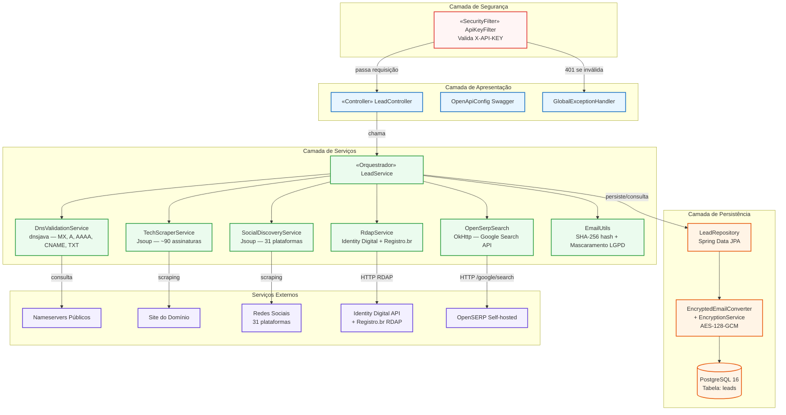
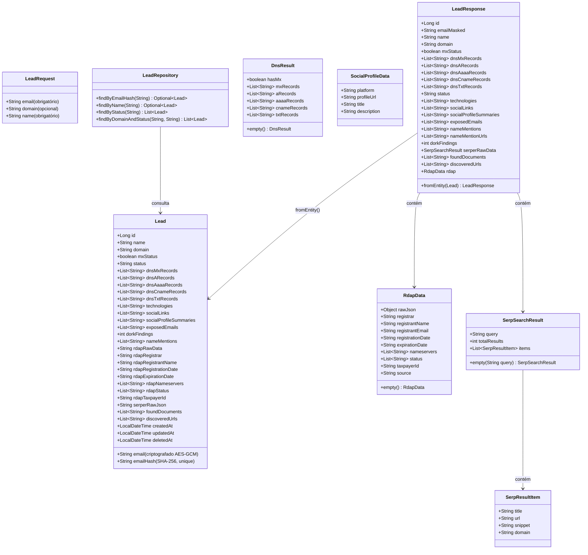
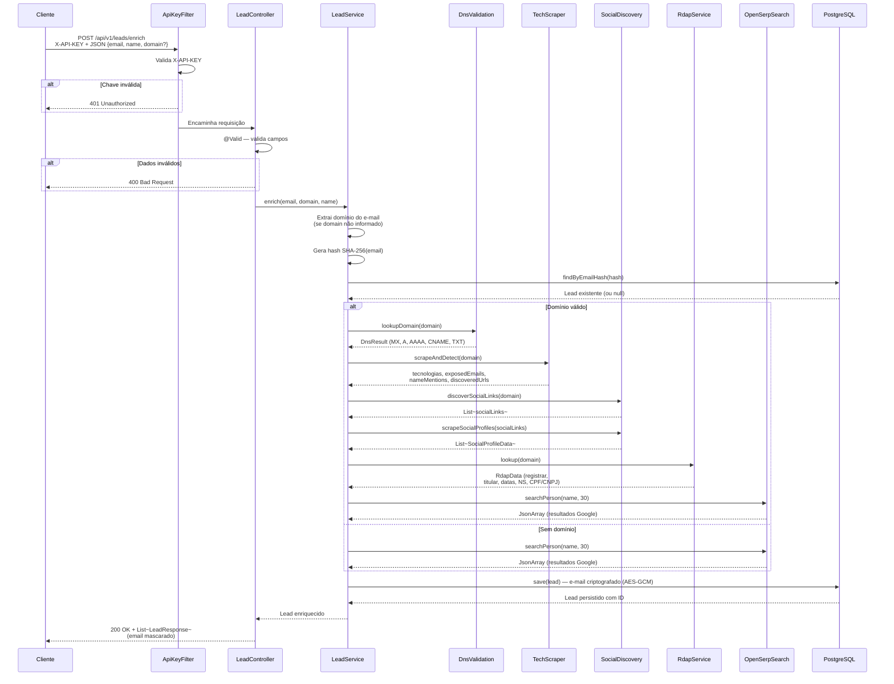

# Diagrama de Componentes e Sequência

## Diagrama de Componentes

```mermaid
graph TB
    subgraph "Camada de Apresentação"
        LC["«Controller» LeadController"]
        OAC["OpenApiConfig Swagger"]
        GEH["GlobalExceptionHandler"]
    end

    subgraph "Camada de Segurança"
        AKF["«SecurityFilter» ApiKeyFilter<br/>Valida X-API-KEY"]
    end

    subgraph "Camada de Serviços"
        LS["«Orquestrador» LeadService"]
        DNS["DnsValidationService<br/>dnsjava — MX, A, AAAA, CNAME, TXT"]
        TSS["TechScraperService<br/>Jsoup — ~90 assinaturas"]
        SDS["SocialDiscoveryService<br/>Jsoup — 31 plataformas"]
        RS["RdapService<br/>Identity Digital + Registro.br"]
        OSS["OpenSerpSearch<br/>OkHttp — Google Search API"]
        EU["EmailUtils<br/>SHA-256 hash + Mascaramento LGPD"]
    end

    subgraph "Camada de Persistência"
        LREPO["LeadRepository<br/>Spring Data JPA"]
        EEC["EncryptedEmailConverter<br/>+ EncryptionService<br/>AES-128-GCM"]
        DB[("PostgreSQL 16<br/>Tabela: leads")]
    end

    subgraph "Serviços Externos"
        NS["Nameservers Públicos"]
        WEB["Site do Domínio"]
        SOCIAL["Redes Sociais<br/>31 plataformas"]
        RDAP_API["Identity Digital API<br/>+ Registro.br RDAP"]
        OPENSERP["OpenSERP Self-hosted"]
    end

    %% Conexões
    AKF -->|401 se inválida| GEH
    AKF -->|passa requisição| LC

    LC -->|chama| LS

    LS --> DNS
    LS --> TSS
    LS --> SDS
    LS --> RS
    LS --> OSS
    LS --> EU

    LS -->|persiste/consulta| LREPO
    LREPO --> EEC
    EEC --> DB

    DNS -->|consulta| NS
    TSS -->|scraping| WEB
    SDS -->|scraping| SOCIAL
    RS -->|HTTP RDAP| RDAP_API
    OSS -->|HTTP /google/search| OPENSERP

    %% Estilo
    classDef controller fill:#e7f5ff,stroke:#1971c2,stroke-width:2px
    classDef security fill:#fff5f5,stroke:#e03131,stroke-width:2px
    classDef service fill:#ebfbee,stroke:#2f9e44,stroke-width:2px
    classDef persistence fill:#fff4e6,stroke:#e8590c,stroke-width:2px
    classDef external fill:#f3f0ff,stroke:#6741d9,stroke-width:2px

    class LC,OAC,GEH controller
    class AKF security
    class LS,DNS,TSS,SDS,RS,OSS,EU service
    class LREPO,EEC,DB persistence
    class NS,WEB,SOCIAL,RDAP_API,OPENSERP external
```

## Diagrama de Classes (Modelo de Domínio)

```mermaid
classDiagram
    class Lead {
        +Long id
        +String email (criptografado AES-GCM)
        +String emailHash (SHA-256, unique)
        +String name
        +String domain
        +boolean mxStatus
        +String status
        +List~String~ dnsMxRecords
        +List~String~ dnsARecords
        +List~String~ dnsAaaaRecords
        +List~String~ dnsCnameRecords
        +List~String~ dnsTxtRecords
        +List~String~ technologies
        +List~String~ socialLinks
        +List~String~ socialProfileSummaries
        +List~String~ exposedEmails
        +int dorkFindings
        +List~String~ nameMentions
        +String rdapRawData
        +String rdapRegistrar
        +String rdapRegistrantName
        +String rdapRegistrationDate
        +String rdapExpirationDate
        +List~String~ rdapNameservers
        +List~String~ rdapStatus
        +String rdapTaxpayerId
        +String serperRawJson
        +List~String~ foundDocuments
        +List~String~ discoveredUrls
        +LocalDateTime createdAt
        +LocalDateTime updatedAt
        +LocalDateTime deletedAt
    }

    class LeadRequest {
        +String email (obrigatório)
        +String domain (opcional)
        +String name (obrigatório)
    }

    class LeadResponse {
        +Long id
        +String emailMasked
        +String name
        +String domain
        +boolean mxStatus
        +List~String~ dnsMxRecords
        +List~String~ dnsARecords
        +List~String~ dnsAaaaRecords
        +List~String~ dnsCnameRecords
        +List~String~ dnsTxtRecords
        +String status
        +List~String~ technologies
        +List~String~ socialLinks
        +List~String~ socialProfileSummaries
        +List~String~ exposedEmails
        +List~String~ nameMentions
        +List~String~ nameMentionUrls
        +int dorkFindings
        +SerpSearchResult serperRawData
        +List~String~ foundDocuments
        +List~String~ discoveredUrls
        +RdapData rdap
        +fromEntity(Lead) LeadResponse
    }

    class DnsResult {
        +boolean hasMx
        +List~String~ mxRecords
        +List~String~ aRecords
        +List~String~ aaaaRecords
        +List~String~ cnameRecords
        +List~String~ txtRecords
        +empty() DnsResult
    }

    class RdapData {
        +Object rawJson
        +String registrar
        +String registrantName
        +String registrantEmail
        +String registrationDate
        +String expirationDate
        +List~String~ nameservers
        +List~String~ status
        +String taxpayerId
        +String source
        +empty() RdapData
    }

    class SerpSearchResult {
        +String query
        +int totalResults
        +List~SerpResultItem~ items
        +empty(String query) SerpSearchResult
    }

    class SerpResultItem {
        +String title
        +String url
        +String snippet
        +String domain
    }

    class SocialProfileData {
        +String platform
        +String profileUrl
        +String title
        +String description
    }

    class LeadRepository {
        +findByEmailHash(String) Optional~Lead~
        +findByName(String) Optional~Lead~
        +findByStatus(String) List~Lead~
        +findByDomainAndStatus(String, String) List~Lead~
    }

    LeadRepository --> Lead : consulta
    LeadResponse --> Lead : fromEntity()
    LeadResponse --> RdapData : contém
    LeadResponse --> SerpSearchResult : contém
    SerpSearchResult --> SerpResultItem : contém
```

## Diagrama de Sequência — Enriquecimento de Lead

```mermaid
sequenceDiagram
    participant C as Cliente
    participant AK as ApiKeyFilter
    participant LC as LeadController
    participant LS as LeadService
    participant DNS as DnsValidation
    participant TSS as TechScraper
    participant SDS as SocialDiscovery
    participant RS as RdapService
    participant OSS as OpenSerpSearch
    participant DB as PostgreSQL

    C->>AK: POST /api/v1/leads/enrich<br/>X-API-KEY + JSON {email, name, domain?}
    
    AK->>AK: Valida X-API-KEY
    alt Chave inválida
        AK-->>C: 401 Unauthorized
    end

    AK->>LC: Encaminha requisição

    LC->>LC: @Valid — valida campos
    alt Dados inválidos
        LC-->>C: 400 Bad Request
    end

    LC->>LS: enrich(email, domain, name)

    LS->>LS: Extrai domínio do e-mail<br/>(se domain não informado)
    LS->>LS: Gera hash SHA-256(email)
    LS->>DB: findByEmailHash(hash)
    DB-->>LS: Lead existente (ou null)

    alt Domínio válido
        LS->>DNS: lookupDomain(domain)
        DNS-->>LS: DnsResult (MX, A, AAAA, CNAME, TXT)

        LS->>TSS: scrapeAndDetect(domain)
        TSS-->>LS: tecnologias, exposedEmails,<br/>nameMentions, discoveredUrls

        LS->>SDS: discoverSocialLinks(domain)
        SDS-->>LS: List~socialLinks~

        LS->>SDS: scrapeSocialProfiles(socialLinks)
        SDS-->>LS: List~SocialProfileData~

        LS->>RS: lookup(domain)
        RS-->>LS: RdapData (registrar,<br/>titular, datas, NS, CPF/CNPJ)

        LS->>OSS: searchPerson(name, 30)
        OSS-->>LS: JsonArray (resultados Google)
    else Sem domínio
        LS->>OSS: searchPerson(name, 30)
        OSS-->>LS: JsonArray (resultados Google)
    end

    LS->>DB: save(lead) — e-mail criptografado (AES-GCM)
    DB-->>LS: Lead persistido com ID

    LS-->>LC: Lead enriquecido
    LC-->>C: 200 OK + List~LeadResponse~<br/>(email mascarado)
```
