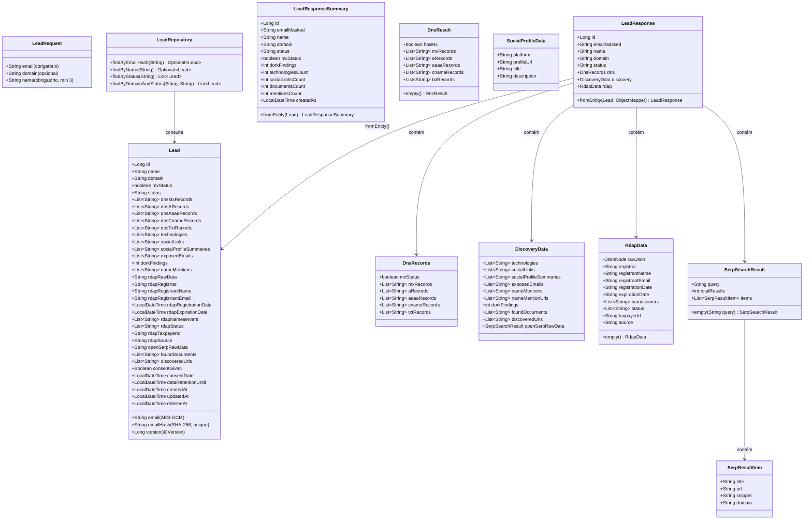
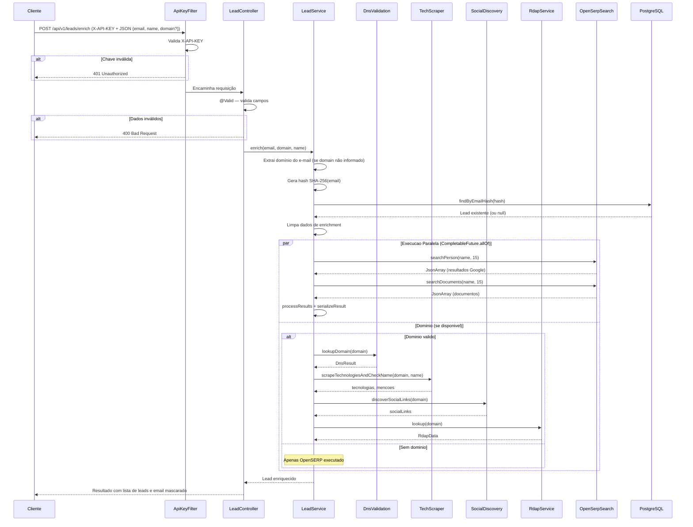

# Diagrama de Componentes e Sequência — Lead Enrichment API

## Diagrama de Componentes (Atualizado)

```mermaid
graph TB
    subgraph "Camada de Apresentação"
        LC["«Controller» LeadController"]
        OAC["OpenApiConfig Swagger"]
        GEH["GlobalExceptionHandler"]
    end

    subgraph "Camada de Segurança"
        AKF["«SecurityFilter» ApiKeyFilter<br/>Valida X-API-KEY"]
        TF["TracingFilter<br/>OpenTelemetry<br/>Request/Response body capture"]
    end

    subgraph "Camada de Configuração"
        APP["AppConfig<br/>RestTemplate, Caffeine caches<br/>CacheManager (@Cacheable)<br/>Virtual Thread Executor"]
        RCFG["RedisConfig<br/>@ConditionalOnProperty<br/>LettuceConnectionFactory"]
        TCP["TechScraperProperties<br/>(assinaturas YAML)"]
        SDP["SocialDiscoveryProperties<br/>(domínios + plataformas)"]
        OSP["OpenSerpProxyProperties<br/>(endpoints + proxy rotation)"]
    end

    subgraph "Camada de Serviços"
        LS["«Orquestrador» LeadService<br/>⚡ CompletableFuture.allOf<br/>⏱ orTimeout 2min"]
        OSE["OpenSerpEnricher<br/>6 buscas paralelas<br/>Merge seguro com Domain"]
        DE["DomainEnricher<br/>DNS, RDAP, scraping<br/>executeSafely pattern"]
        LDS["LeadDeletionService<br/>Hard delete (1 query)"]
        DNS["DnsValidationService<br/>dnsjava — 5 tipos DNS<br/>Cache Caffeine 1h"]
        TSS["TechScraperService<br/>Jsoup — 90+ assinaturas<br/>Cache Caffeine 1h"]
        SDS["SocialDiscoveryService<br/>Jsoup — 31 plataformas<br/>2 caches Caffeine"]
        RS["RdapService<br/>Identity Digital + Registro.br<br/>Cache Caffeine 1h"]
        OSS["OpenSerpSearch<br/>Cache L1 Caffeine + L2 Redis<br/>Circuit breaker + rate limit"]
        RCS["RedisCacheService<br/>L2 distribuído<br/>Async set + fallback"]
        ES["EncryptionService<br/>AES-128-GCM"]
    end

    subgraph "Camada Utilitária"
        EU["EmailUtils<br/>SHA-256 + Mascaramento LGPD<br/>ThreadLocal MessageDigest"]
        DP["DataParser<br/>COMMON_EMAIL_PROVIDERS<br/>nameMatchesExactly"]
        CT["ContentTracker<br/>Hash SHA-256 para<br/>detecção de mudanças"]
    end

    subgraph "Camada de Persistência"
        LREPO["LeadRepository<br/>Spring Data JPA"]
        EEC["EncryptedEmailConverter<br/>AES-128-GCM"]
        DB[("PostgreSQL 16<br/>@Fetch(SUBSELECT)<br/>@Version otimista<br/>@BatchSize(10)")]
    end

    subgraph "Cache Distribuído"
        REDIS[("Redis<br/>Cache L2")]
    end

    subgraph "Serviços Externos"
        NS["Nameservers Públicos"]
        WEB["Site do Domínio"]
        SOCIAL["Redes Sociais"]
        RDAP_API["Identity Digital<br/>+ Registro.br"]
        OPENSERP["OpenSERP Self-hosted<br/>3 instâncias"]
    end

    AKF -->|401| GEH
    AKF --> LC
    LC --> LS

    LS --> OSE
    LS --> DE
    LS --> LDS
    LS --> DP
    LS --> EU

    OSE --> OSS
    OSE --> SDS
    OSS --> RCS
    DE --> DNS
    DE --> TSS
    DE --> SDS
    DE --> RS

    OSS --> OSP
    RCS --> REDIS

    LS --> LREPO
    LREPO --> EEC
    EEC --> DB

    DNS --> NS
    TSS --> WEB
    SDS --> SOCIAL
    RS --> RDAP_API
    OSS --> OPENSERP

    classDef controller fill:#e7f5ff,stroke:#1971c2,stroke-width:2px
    classDef security fill:#fff5f5,stroke:#e03131,stroke-width:2px
    classDef service fill:#ebfbee,stroke:#2f9e44,stroke-width:2px
    classDef persistence fill:#fff4e6,stroke:#e8590c,stroke-width:2px
    classDef external fill:#f3f0ff,stroke:#6741d9,stroke-width:2px
    classDef cache fill:#fff3bf,stroke:#f08c00,stroke-width:2px

    class LC,OAC,GEH controller
    class AKF,TF security
    class APP,RCFG,TCP,SDP,OSP config
    class LS,OSE,DE,LDS,DNS,TSS,SDS,RS,OSS,RCS,ES service
    class EU,DP,CT service
    class LREPO,EEC,DB persistence
    class REDIS cache
    class NS,WEB,SOCIAL,RDAP_API,OPENSERP external
```

## Diagrama de Classes (Modelo de Domínio — Atualizado)

## Diagrama de Sequência — Enriquecimento de Lead

