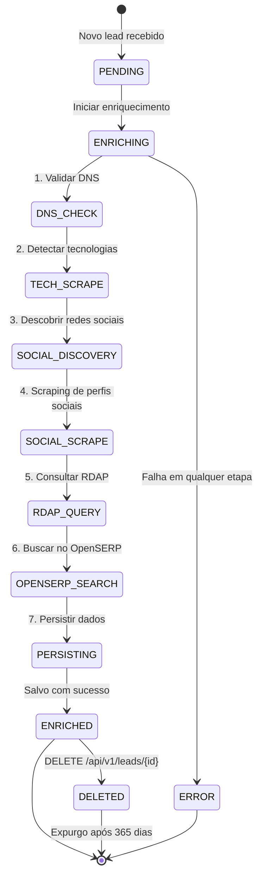
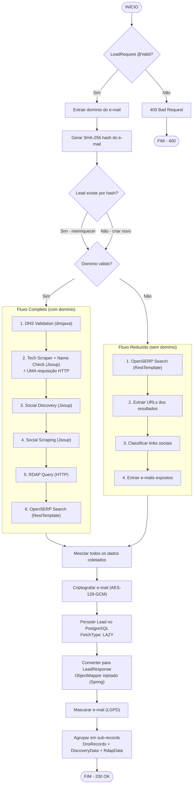
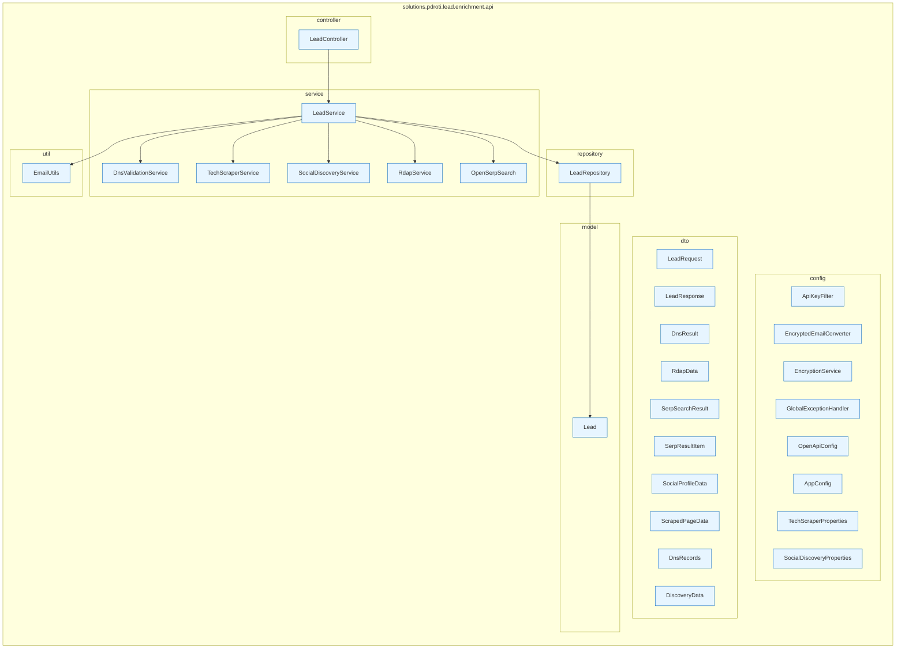
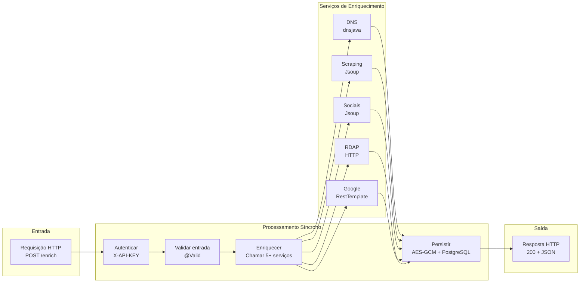

# Diagrama UML — Fluxo de Enriquecimento

## Diagrama de Estado do Lead

## Diagrama de Fluxo — Enriquecimento Completo

## Diagrama de Pacotes

## Diagrama de Atividades — Enriquecimento de Lead

