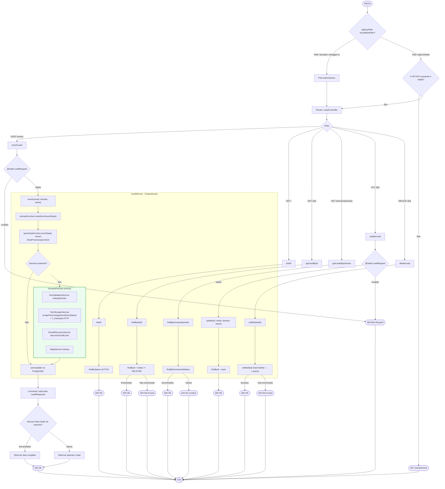
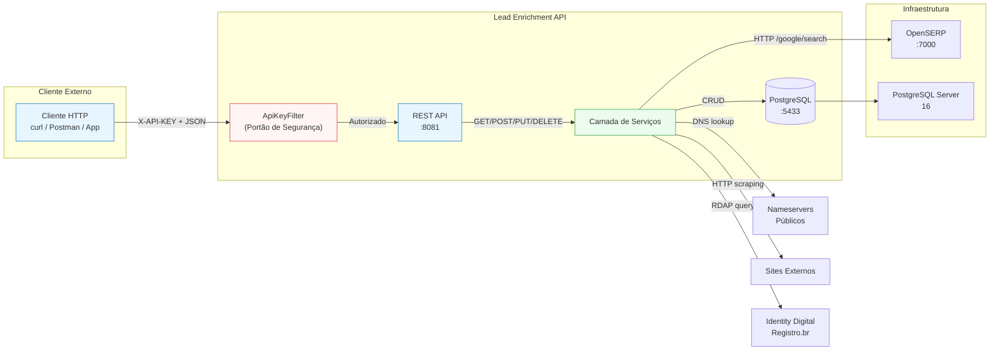
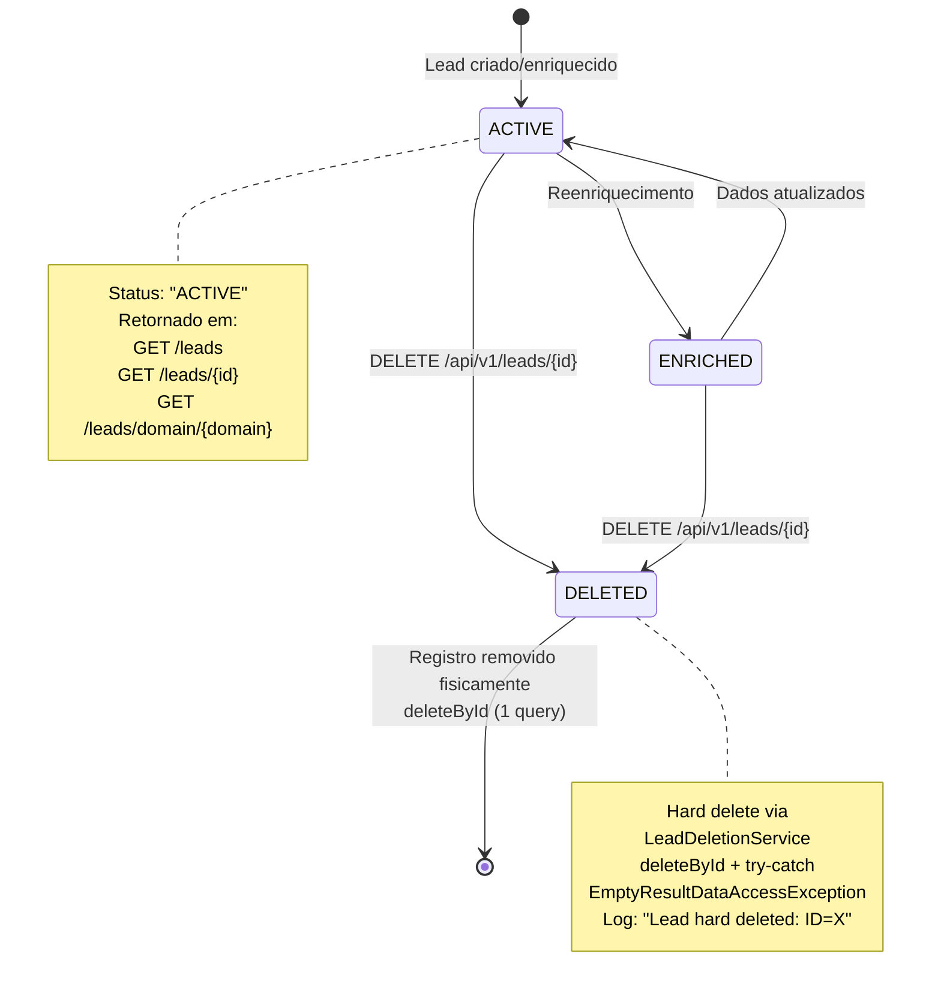
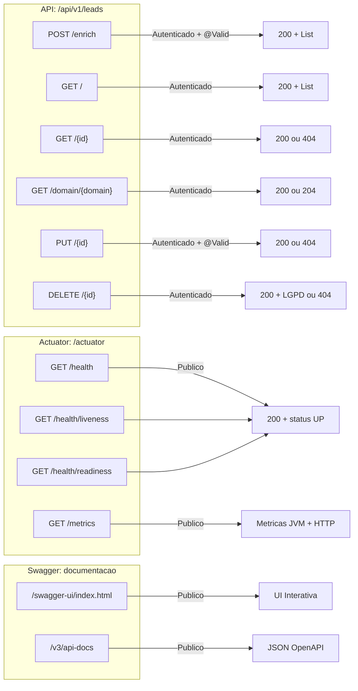

# Fluxo de Processamento da API

## Fluxograma de Requisição/Resposta

> **Nota:** Desde a refatoração, o `LeadService` passou a ser um orquestrador puro (~140 linhas) que delega para `OpenSerpEnricher` (busca Google), `DomainEnricher` (DNS + RDAP + scraping + sociais) e `LeadDeletionService` (hard delete em 1 query). O fluxo completo de tecnologias + verificação de nome é feito em **uma única requisição HTTP** via `scrapeTechnologiesAndCheckName()`. O `OpenSerpSearch` usa `RestTemplate` (gerenciado pelo Spring) em vez de `OkHttpClient` manual.

## Diagrama de Contexto da API

## Diagrama de Estados do Endpoint DELETE (Hard Delete)

## Mapa de Endpoints

