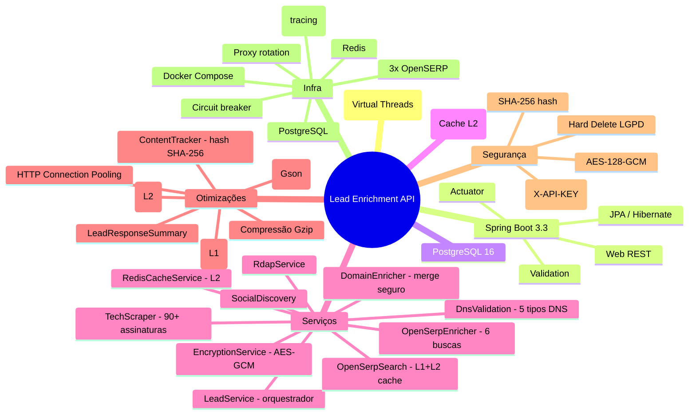

# Lead Enrichment API — Índice da Documentação

> [⬅ Voltar ao README principal](../README.md)

## Visão Geral

API corporativa para enriquecimento de leads a partir de dados públicos da internet. A partir de um nome e e-mail, o sistema orquestra múltiplos serviços especializados para descobrir informações sobre domínio, stack tecnológica, presença em redes sociais e dados de registro de domínio — operando em conformidade com os requisitos da LGPD.

**Stack:** Java 21 (Virtual Threads) + Spring Boot 3.3.13 + PostgreSQL 16 + Redis (cache L2) + OpenSERP (Google Search API)

## Navegação da Documentação

| Documento | Conteúdo |
|---|---|
| [📐 Arquitetura do Sistema](./architecture.md) | Diagramas estruturais, fluxos de dados, stack tecnológica e organização do projeto |
| [📡 Guia da API](./api-guide.md) | Contratos dos endpoints, parâmetros, exemplos de requisição/resposta e código de erros |
| [🚀 Guia de Implantação](./deployment.md) | Docker Compose, variáveis de ambiente, estratégia de produção e troubleshooting |
| [🔒 Segurança e LGPD](./security-lgpd.md) | Criptografia AES-128-GCM, mascaramento de PII, autenticação por API Key e compliance |
| [📜 Contrato OpenAPI (YAML)](./openapi.yaml) | Especificação OpenAPI 3.0 completa para geração automatizada de clientes |
| [🔧 Referência Técnica](./TECHNICAL_REFERENCE.md) | Arquitetura em camadas, pipeline de enriquecimento, performance e dependências |
| [👋 Guia de Onboarding](./ONBOARDING.md) | Configuração do ambiente local, fluxo de desenvolvimento e troubleshooting |

## Architecture Decision Records (ADRs)

Registro formal de decisões arquiteturais com contexto, alternativas consideradas e justificativas.

| ID | Decisão | Escopo |
|---|---|---|
| [ADR-001](./adr/ADR-001-stack-tecnologica.md) | **Java 21** + Spring Boot 3.3 + Maven + Lombok | Stack tecnológica |
| [ADR-002](./adr/ADR-002-postgresql-jpa.md) | PostgreSQL 16 com `ddl-auto=update` e `@ElementCollection` | Persistência |
| [ADR-003](./adr/ADR-003-criptografia-pii-aes-gcm.md) | AES-128-GCM via `AttributeConverter` + SHA-256 hash | Proteção de PII |
| [ADR-004](./adr/ADR-004-soft-delete-lgpd.md) | **Hard delete** via `LeadDeletionService` (única consulta) | Exclusão LGPD |
| [ADR-005](./adr/ADR-005-api-key-autenticacao.md) | Servlet Filter com validação do header `X-API-KEY` | Autenticação |
| [ADR-006](./adr/ADR-006-arquitetura-enriquecimento.md) | Orquestração centralizada — 12 serviços especializados com isolamento de falhas | Pipeline de enriquecimento |
| [ADR-007](./adr/ADR-007-springdoc-openapi.md) | Swagger UI auto-gerado via SpringDoc com schema de segurança documentado | Documentação da API |
| [ADR-008](./adr/ADR-008-mascaramento-dados-lgpd.md) | `EmailUtils` com mascaramento centralizado em logs e respostas | Privacidade de dados |
| [ADR-009](./adr/ADR-009-tratamento-global-erros.md) | `@RestControllerAdvice` com resposta JSON padronizada | Tratamento de erros |
| [ADR-010](./adr/ADR-010-configuracao-externalizada.md) | `@ConfigurationProperties` para módulos TechScraper, SocialDiscovery e OpenSerpProxy | Configuração externalizada |

---

## Diagramas da Arquitetura

Diagramas em Mermaid com renderização nativa no GitHub e no VS Code.

| Diagrama | Arquivo | Abrangência |
|---|---|---|
| [🟦 Componentes e Sequência](./diagrams/mermaid-componentes-sequencia.md) | `docs/diagrams/mermaid-componentes-sequencia.md` | Diagrama de componentes (4 camadas + cache Redis), modelo de domínio e sequência completa de enriquecimento |
| [🔀 Fluxo de Enriquecimento](./diagrams/mermaid-fluxo-enriquecimento.md) | `docs/diagrams/mermaid-fluxo-enriquecimento.md` | Máquina de estados do Lead (PENDING → ENRICHED → DELETED) e fluxograma reduzido vs. completo |
| [⚙️ Fluxo de Processamento](./diagrams/mermaid-fluxo-processamento-api.md) | `docs/diagrams/mermaid-fluxo-processamento-api.md` | Fluxo requisição/resposta para todos os 6 endpoints e mapa de contexto |

---

## Evolução Arquitetural

Aprimoramentos implementados ao longo de ciclos de revisão, organizados por domínio arquitetural:

### Segurança
- Credenciais externalizadas para `.env` (remoção de valores hard-coded)
- Criptografia AES-128-GCM sem fallback e com log + throw em falha de descriptografia
- Autenticação por API Key via Servlet Filter com validação de header

### Plataforma e Runtime
- Migração JDK 17 → 21 com Virtual Threads (`Executors.newVirtualThreadPerTaskExecutor()`)
- Observabilidade com OpenTelemetry + Jaeger com captura de corpo de requisição e resposta

### Performance e Concorrência
- Cache em dois níveis: Caffeine (L1) + Redis (L2)
- ContentTracker com hash SHA-256 para detecção de conteúdo duplicado
- HTTP Connection Pooling com HttpClient 5, compressão Gzip e paginação
- Consultas DNS paralelas (5 tipos) e 6 buscas OpenSERP simultâneas
- Merge seguro contra race condition com cópia defensiva em cache

### Refatoração da Arquitetura
- Extração de responsabilidades: `LeadService` decomposto em `OpenSerpEnricher`, `DomainEnricher`, `LeadDeletionService`, `RedisCacheService`
- Eliminação de N+1 com `@Fetch(FetchMode.SUBSELECT)`, lock otimista com `@Version` e `@BatchSize`

### Manutenibilidade
- Adoção de `@ConfigurationPropertiesScan`, `@EnableCaching`, `LeadResponseSummary`
- 10 ADRs documentando decisões arquiteturais

---

## Início Rápido

```bash
# 1. Configurar variáveis de ambiente
cp .env.example .env
# Editar .env com as credenciais reais

# 2. Executar com Docker Compose
docker compose up --build

# 3. Acessar a API
curl -H "X-API-KEY: $(grep API_KEY .env | cut -d= -f2)" \
  -H "Content-Type: application/json" \
  -X POST http://localhost:${PORT:-8081}/api/v1/leads/enrich \
  -d '{"email":"contato@exemplo.com","name":"João Silva"}'

# 4. Swagger UI: http://localhost:${PORT:-8081}/swagger-ui.html
```

## Stack Tecnológica



## Licença

Copyright © 2026 pdroti.solutions
