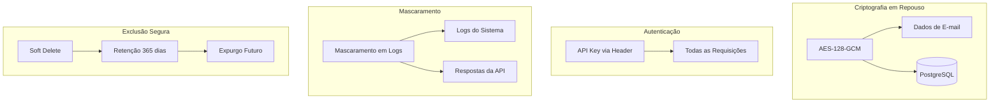
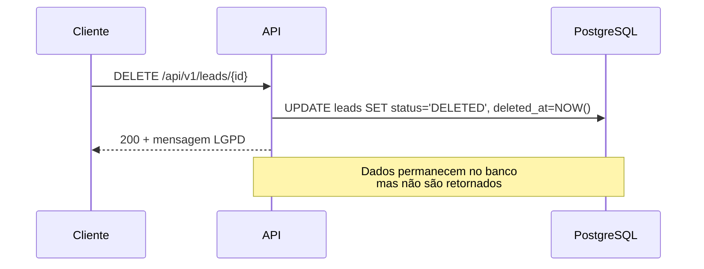

# Segurança e Conformidade LGPD

## Visão Geral

A Lead Enrichment API foi projetada com privacidade e segurança como requisitos fundamentais, implementando controles para atender à **Lei Geral de Proteção de Dados (LGPD — Lei 13.709/2018)**.

## Pilares de Segurança



---

## 1. Criptografia de E-mails (PII)

### Algoritmo

- **AES-128-GCM** (Galois/Counter Mode)
- IV aleatório de 12 bytes por operação
- Tag de autenticação GCM de 128 bits
- Formato armazenado: `ENC(<Base64(IV + Ciphertext)>)`

### Implementação

| Componente | Arquivo | Responsabilidade |
|---|---|---|
| `EncryptionService` | `config/EncryptionService.java` | Serviço de criptografia AES-GCM |
| `EncryptedEmailConverter` | `config/EncryptedEmailConverter.java` | Converter automático JPA |

### Fluxo de Criptografia

```
Entrada (texto plano): "joao@exemplo.com"
         │
         ▼
  AES-128-GCM.encrypt()
         │
         ├─ Gera IV aleatório (12 bytes)
         ├─ Criptografa com chave secreta
         └─ Concatena IV + Ciphertext
         │
         ▼
  Base64.encode()
         │
         ▼
  Armazenado: "ENC(<base64>)"
```

### Segurança da Chave

- A chave é configurada via variável de ambiente `ENCRYPTION_SECRET`
- Mínimo de **16 bytes** (128 bits) — idealmente 32 bytes para AES-256
- **Nunca** versionar a chave no código-fonte
- Em produção, usar um cofre de segredos (Azure Key Vault, AWS Secrets Manager)

---

## 2. Mascaramento de Dados (LGPD Art. 6)

### Em Respostas da API

O campo `email` nunca é retornado nas respostas. Em seu lugar, é retornado `emailMasked`:

| Original | Mascarado |
|---|---|
| `pedro@pdroti.com` | `ped***@pdroti.com` |
| `joao@exemplo.com` | `joa***@exemplo.com` |
| `ab@cd.com` | `ab***@cd.com` |

### Em Logs

Todos os logs da aplicação utilizam `EmailUtils.mask()` para exibir apenas os 3 primeiros caracteres do e-mail:

```
INFO  LeadService - Enriquecendo lead: nome=João email=jo***@exemplo.com
```

---

## 3. Armazenamento Seguro (LGPD Art. 46)

### Hash para Consulta

O e-mail original é criptografado (AES-GCM), o que impossibilita consultas diretas `WHERE email = ?`. Para permitir lookup sem expor o dado:

1. Um campo `emailHash` armazena o **SHA-256** do e-mail (lowercase)
2. Consultas por e-mail usam `findByEmailHash(hash)`
3. O campo é `unique = true`, garantindo que não haja leads duplicados

```java
@Column(length = 64, unique = true)
private String emailHash;
```

### Thread-Safety

O `MessageDigest` para SHA-256 é cacheado via `ThreadLocal` para desempenho:

```java
private static final ThreadLocal<MessageDigest> DIGEST_CACHE =
    ThreadLocal.withInitial(() -> { ... });
```

---

## 4. Autenticação (LGPD Art. 47)

### API Key via Header

Todas as requisições devem incluir o header:

```
X-API-KEY: <chave-secreta>
```

### Endpoints Públicos

Os seguintes endpoints **não exigem** autenticação:

| Path | Finalidade |
|---|---|
| `/actuator/**` | Health checks, métricas |
| `/swagger-ui/**` | Documentação Swagger |
| `/v3/api-docs/**` | OpenAPI spec |
| `/swagger-resources/**` | Recursos Swagger |

### Resposta de Erro (401)

```json
{
  "error": "API Key ausente ou inválida",
  "message": "Forneça uma chave válida no header X-API-KEY",
  "timestamp": "2026-06-10T12:00:00"
}
```

---

## 5. Soft Delete (LGPD Art. 18, VI)

### Direito ao Esquecimento

A LGPD garante ao titular o direito de solicitar a exclusão de seus dados pessoais. A API implementa **soft delete**:



### Comportamento

| Operação | Comportamento após soft delete |
|---|---|
| `GET /leads` | Não retorna leads DELETED |
| `GET /leads/{id}` | Retorna 404 |
| `GET /leads/domain/{domain}` | Não retorna leads DELETED |
| `PUT /leads/{id}` | Retorna 404 |

### Retenção de Dados

- Dados soft-deleted são mantidos por **365 dias**
- Após esse período, um job futuro deverá realizar o expurgo físico
- Durante a retenção, os dados permanecem criptografados

---

## 6. Medidas de Segurança Adicionais

### Validação de Entrada

- Beans validation com `@Valid` + `@NotBlank`, `@Email`
- Erros de validação retornam HTTP 400 com detalhes dos campos

### Tratamento de Erros Global

- `GlobalExceptionHandler` padroniza todas as respostas de erro
- Desconexões de cliente são tratadas silenciosamente (sem stack trace)

### Timeouts

| Componente | Timeout |
|---|---|
| Tomcat connection | 300s |
| Spring MVC async | 300s |
| Scraping (Jsoup) | 10s |
| OpenSERP connect | 5s |
| OpenSERP read | 20s |
| RDAP HTTP | 10s |

---

## 7. Checklist de Conformidade LGPD

| Requisito LGPD | Implementação | Status |
|---|---|---|
| **Art. 6 — Princípios** (finalidade, adequação, necessidade) | Coleta apenas dados públicos para enriquecimento | ✅ |
| **Art. 18, VI — Direito ao esquecimento** | Soft delete via `DELETE /api/v1/leads/{id}` | ✅ |
| **Art. 46 — Medidas de segurança** | AES-128-GCM + SHA-256 + API Key | ✅ |
| **Art. 47 — Boas práticas** | Mascaramento em logs e respostas | ✅ |
| **Art. 49 — Término do tratamento** | Retenção de 365 dias com expurgo futuro | ✅ |
| **Privacidade desde a concepção** | Criptografia automaticamente aplicada | ✅ |

---

## Recomendações para Produção

1. **Chave de criptografia forte:** Use uma chave AES-256 (32 bytes) codificada em Base64
2. **Gerenciamento de segredos:** Azure Key Vault, AWS Secrets Manager ou HashiCorp Vault
3. **TLS/HTTPS:** Sempre use HTTPS em produção
4. **Rotação de chaves:** Implemente rotação periódica da `ENCRYPTION_SECRET`
5. **Auditoria:** Monitore logs de exclusão e acesso a dados sensíveis
6. **Expurgo automático:** Implemente job schedulado para limpeza de registros com mais de 365 dias
